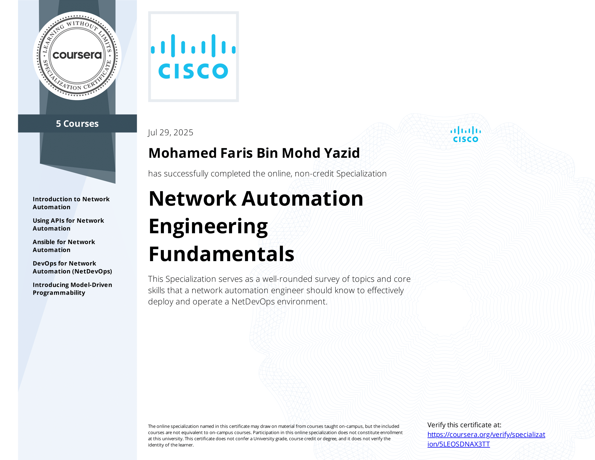

# Cisco-Network-Automation-Engineering
This is a course on Coursera by Cisco on network automation. Extremely beneficial to learn the overview of network automation as well as some syntax for code.

# Topics Covered
- Introduction to Network Automation
- Using APIs for Network Automation
- Ansible for Network Automation
- DevOps for Network Automation (NetDevOps)
- Introducing Model-Driven Programmability

# My Certificate

